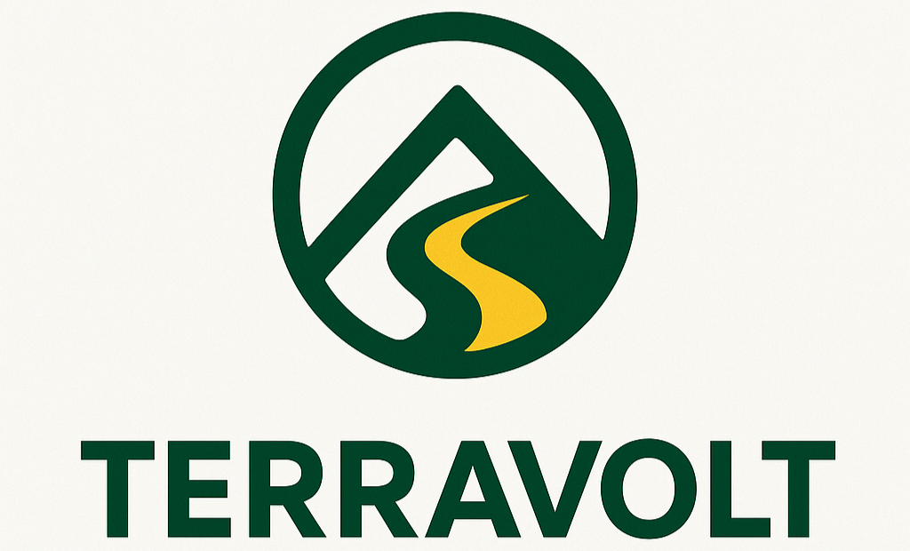
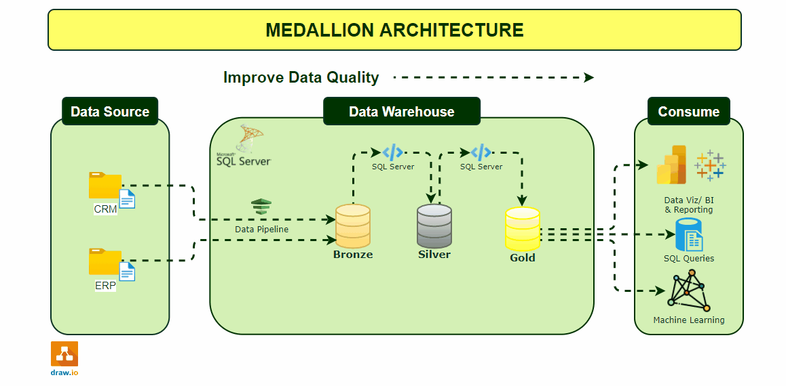

<p align = "center">
   
</p>

<h1 align = "center"><b>TerraVolt Enterprise Data Warehouse(EDW) & Analytics End-to-End Project</b></h1>

<!-----table of content--->  

<h1 id="top">Table of Contents</h1>

1. [Executive Summary](#executive-summary)  
2. [Company Background](#company-background)
3. [Project Overview](#project-overview)
    1. [SQL Data Warehouse Initiative](#sql-data-warehouse-initiative)  
    2. [EDA & Advanced Analytics Scope](#eda--advanced-analytics-scope)  
    3. [North Star Metrics](#north-star-metrics)  
4. [Project Requirements](#project-requirements)
5. [Data Architecture](#data-architecture)
   1. [Medallion Architecture](#medallion-architecture)  
   2. [Source System Integration](#source-system-integration)  
   3. [Data Modeling](#data-modeling)
6. [ETL Pipeline Design](#etl-pipeline-design)
7. [Data Quality and Governance](#data-quality-and-governance)
8. [Exploratory Data Analysis](#exploratory-data-analysis)
7. [Advanced Data Analytics](#advanced-data-analytics)
    1. [Customer Segmentation](#customer-segmentation)
    2. [Product Performance Analytics](#product-performance-analytics)
    3. [Insights and Recommendations](#insights-and-recommendations)
10. [Clarifying Questions, Assumptions and Caveats](#clarifying-questions-assumptions-and-caveats)
11. [Repository Structure](#repository-structure)
12. [Tools and Technology Used](#tools-and-technology-used)
14. [How to Reproduce This Project](#how-to-reproduce-this-project)
15. [Future Enhancements](#future-enhancements)
16. [Author](#author)  

## Executive Summary

Founded in **2008**, **TerraVolt** is a global e-commerce enterprise specializing in **bicycles, components, and cycling apparel**. The company operates across multiple continents, leveraging digital platforms to deliver high-performance products to an international customer base.
As TerraVolt’s operations expanded, its data environment became increasingly complex, with disparate systems generating large volumes of transactional, customer, and operational data. The absence of centralized integration led to data silos, inconsistent reporting, and limited analytical visibility across business functions.

To overcome these challenges, TerraVolt launched the **SQL Data Warehouse Initiative**, a strategic data modernization project designed to consolidate fragmented data sources into a **centralized analytical ecosystem**. This warehouse will enable a single source of truth for business intelligence, support data-driven decision-making, and enhance enterprise performance through reliable, scalable, and governed analytics infrastructure.

In addition to the data warehousing build, this project incorporates an advanced Data Analysis and Business Intelligence (BI) capability. This includes comprehensive Exploratory Data Analysis (EDA), statistical profiling, time-series trend evaluation, and customer/product performance analytics. The BI layer strengthens TerraVolt’s ability to derive meaningful insights by enabling dynamic dashboards, KPI monitoring, forecasting foundations, and real-time decision support, ensuring that the SQL warehouse becomes both an analytical engine and a business-facing intelligence platform.

## Company Background

**TerraVolt** is a **global e-commerce company**, founded in **2014**, that provides an extensive range of **bikes, cycling components, and apparel**. With operations in **North America, Europe, Asia, and Africa**, TerraVolt has built a strong reputation for digital innovation, product quality, and customer engagement.
The company’s rapid international growth has led to an increasingly complex data landscape, spanning **ERP, CRM, e-commerce, and marketing systems**. This growth underscored the need for a unified data management framework to enhance operational insight and analytical consistency.

The **SQL EDW project** represents a key milestone in TerraVolt’s data strategy, integrating global data assets into a single, structured, and scalable repository.  
This project delivers a scalable data warehousing solution that integrates data from various sources, empowering data-driven decision-making through a robust **data architecture, ETL pipeline, and data modeling**. By leveraging industry best practices and a **medallion data architecture (Bronze, Silver, and Gold)**, this solution ensures data quality, consistency and reliability.

## Project Overview

### SQL Data Warehouse Initiative  

- **Data Warehouse**: Designing a modern data warehouse using a medallion architecture bronze, silver and gold
- **ETL Pipeline**: Extracting,transforming, and loading data from the data systems a into the data warehouse.
- **Data Modeling**: Developing fact and dimension tables optimized for analytical queries.

### EDA & Advanced Analytics Scope  

### North Star Metrics  

**Data Warehouse**

1. **Data Freshness**: Tracks how quickly data is updated in the warehouse using stored procedures that log load times, ensuring timely insights.
2. **Pipeline Success Rate**: Measures the percentage of data pipelines that complete without errors, maintaining reliable data flow.
3. **Data Accuracy & Consistency**: Validates data after cleaning and transformation to ensure trustworthy, consistent analytics.

 **Data Analytics**  

 1. **Sales Trends**: Focusing on key metrics of the sales revenue, number of orders placed, and average order value (AOV).
 2. **Product Performance**: Analyzing different product lines, market impact to inform strategic product decisions.
 3. **Customer Segmentation**: Analyzing customer groups based on behavior, demographics, and purchase patterns to inform targeted marketing and strategic business decisions.

## Project Requirements

### Building the Data Warehouse (Data Engineering)

#### Objective  

Develop a SQL Server-based data warehouse consolidating sales data for analytical reporting.

#### Specifications

1. **Data Ingestion**: Import data from two data systems (ERP and CRM) provided as CSV files.
2. **Data Quality**: Implement data quality checks to ensure data accuracy and consistency.
3. **Data Integration**: Merging datasets into a **single user-friendly analytical model**.  
4. **Data Modeling**: Implementing a **star schema** (fact & dimension tables).
5. **Data Storage**: Design a scalable data storage solution.
6. **Scope**: Focus on the latest dataset only; historization if data is not required.
7. **Documentation**: Provide clear **metadata & model descriptions**.

### BI: Analytical & Reporting (Data Analysis)

#### Objective

Leverage the **data warehouse** to develop **SQL-driven analytics and reporting solutions** that provide actionable insights for TerraVolt’s business stakeholders. Focus on uncovering trends, measuring performance, and enabling data-driven decisions across sales, products, and customer engagement.

#### Specifications 

1. **Sales Trends Analysis**: Track key sales metrics such as revenue, number of orders, and average order value (AOV) over multiple timeframes (monthly& yearly) to identify growth patterns and seasonality.
2. **Product Performance Analysis**: Evaluate product lines and categories to determine top performers, underperformers, and market impact, supporting strategic product decisions.
3. **Customer Segmentation**: Segment customers based on demographics, purchase behavior, and engagement metrics to inform targeted marketing campaigns and improve retention.
4. **KPI Monitoring**: Build core KPIs including sales growth, repeat purchase rate, and customer churn to measure business performance and identify areas for improvement.
5. **Data Visualization & Reporting**: Design clear, interactive dashboards and reports that enable stakeholders to explore data dynamically, spot anomalies, and make informed decisions.

## Data Architecture  

### Medallion Architecture

The data architecture for this project follows Medallion Architecture **Bronze**, **Silver**, and **Gold** layers:


The link **[here](docs/data_warehouse/high_level_architecture.png)** provide a more detailed diagram of the data.

1. **Bronze Layer**: Stores raw data as-is from the source systems. Data is ingested from CSV Files into SQL Server Database.
2. **Silver Layer**: This layer includes data cleansing, standardization, and normalization processes to improve the data's quality and usability, and prepares the it for analysis.
3. **Gold Layer**: Data is aggregated, summarized, and modeled into a star schema for analytics and reporting, providing business-ready insights and metrics.

### Source System Integration

Consolidate data from ERP & CRM into a centralized warehouse.

.png)

The diagram illustrates the flow of data through the Bronze, Silver and Gold layers, showcasing the movement of data between tables within each layer. It also provides a clear representation of the data architecture and the relationships between the different entities.

.png)

### Data Modeling

The data model is designed to support efficient querying and analysis. It includes:

- **Fact Table** (```gold.fact_orders```): Contains measurable data.
- **Dimension Tables** (```gold.dim_customers``` and ```gold.dim_products```): Provide context for analysis.
- **Data Marts**: Subsets of the data warehouse, focused on the specific business value.

.svg)

## ETL Pipeline Design  

**ETL pipeline**

|           | Bronze   | Silver   |  Gold    |
|:----------|----------|----------|----------|
|**Object Type**|   Tables     |    Tables    |    None    |
|**Load Method**|    Full Load (*Truncate & Insert*)    |    Full Load (*Truncate & Insert*)     |    None    |
|**Data Transformation**|   None    |    <ul><li>Data **Cleaning**</li><li>Data **Standardization**</li><li>Data **Normalization**</li><li>Data **Enrichment**</li></ul>  |    <ul><li>Data **Integration**</li><li>Data **Aggregation**</li><li>**Business Logic & Rules**</li></ul>  |
|**Data Modeling**|   None      |    None    |    <ul><li>**Star Schema**</li><li>**Aggregated Objects**</li><li>**Flat Tables**</li></ul>   |

## Data Quality and Governance

To ensure the integrity and reliability of the dataset, a series of data quality checks for the silver and gold layer were done.

- **Referential Integrity**: Primary key uniqueness and foreign key relationships
- **Data Completeness**: NULL value detection in critical fields
- **Data Consistency**: Establish standardized definitions, cross-table validation, business rules, and transformation logic
- **Data Format**: Standardized formats and trimmed white spaces
- **Logical Validation**: Date ranges, calculated field verification

 The following code illustrates a snippet of thus quality checks from the silver layer.

```sql
-- ------------------------------------CRM Tables--------------------------------
-- ==============================================================================
-- Checking 'silver.crm_cust_info'
-- ==============================================================================
-- Check for NULLS or duplicate keys
-- Expectation : No results 
SELECT 
     cst_id,
     COUNT(*) 
FROM silver.crm_cust_info
GROUP BY cst_id
HAVING COUNT(*) > 1 OR cst_id IS NULL;

-- Checking for unwanted spaces
-- Expectation = No results
SELECT 
     cst_firstname, 
     cst_lastname
FROM silver.crm_cust_info
WHERE 
     (cst_firstname <>  TRIM(cst_firstname)) OR  
     (cst_lastname <> TRIM(cst_lastname));

-- Data standardization and consistency
SELECT DISTINCT cst_gndr
FROM bronze.crm_cust_info

```

For a more comprehensive overview of the data quality checks and results, please refer to the  [data_quality_checks](/tests/).
A detailed issue log of the ETL pipeline was maintained and it tracked all the records of the anomalies per Medallion Layer and how their were remedied. The log for each incident detailed the specific issue, the root_cause analysis and the corrective action. For the full tracker, please click [**here**](docs/data_warehouse/terravolt_changelog.xlsx)

## Exploratory Data Analysis

.svg)

The analysis followed a structured approach, covering various aspects of the data:

1. **Database Exploration:** Understanding the structure and relationships within the database.
2. **Dimensions Exploration:** Analyzing the characteristics of the dimension tables (customers, products).
3. **Date Range Exploration:** Identifying the time period covered by the data.
4. **Measures Exploration:** Examining key metrics and their distributions.
5. **Magnitude Exploration:** Understanding the scale of different measures.
6. **Ranking Analysis:** Identifying top performers (e.g., customers, products).
7. **Change Over Time Analysis:** Tracking trends and patterns over time.
8. **Cumulative Analysis:** Examining the accumulated values of metrics.
9. **Performance Analysis:** Evaluating the performance of different aspects of the business.
10. **Data Segmentation:** Grouping data into meaningful segments for targeted analysis.
11. **Part-to-Whole Analysis:** Understanding the contribution of different parts to the overall picture.

The **Exploratory Data Analysis (EDA)**, performed with SQL, provides actionable insights into the dataset. Access the analysis [here](/scripts/analytics_scripts/).

## BI (Advanced Data Analytics)

### Customer Segmentation
Access the SQL analysis for customer segmentation [here](/scripts/analytics_scripts/12_report_customers.sql).

### Product Performance Analytics
Explore the SQL analysis for product performance [here](/scripts/analytics_scripts/13_report_products.sql).

### Insights and Recommendations

**Key Business Insights:**  
1. **Customer Behavior Analysis**: Identified that **35% of customers account for 70% of revenue**, with the top segment averaging **5 orders per month** and contributing to **60% of repeat purchases**, highlighting high-value customers and opportunities for targeted engagement.  
2. **Product Performance Metrics**:  The top 10 products contribute to **65% of total sales**, while **20% of products account for only 5% of revenue**. Average product margin is **28%**, indicating areas for portfolio optimization and strategic promotions.  
3. **Sales Trend Analysis**: Revenue has grown **15% month-over-month**, with **Q4 accounting for 40% of annual sales** and daily peak sales occurring on Fridays. This informs forecasting, inventory planning, and promotional timing.  

For a comprehensive report of insights and actionable recommendations, click **[here](/terravolt_ecommerce_performance__report.md)**.

## Clarifying Questions, Assumptions and Caveats  

### Stakeholder Queries Identified During Data Quality Validation

- **Unmatched cat_id (category_id)**
During transformation and reconciliation, the team identified that CO_PE, a cat_id value in**bronze.prd_info** does not exist in **bronze.erp_px_cat_glv2** This indicates either referential integrity gaps or an incomplete lookup mapping.
*Clarifying Question: Which upstream system serves as the authoritative source of truth for cat_id — the CRM platform or the ERP system?*
- **Ambiguous Product Line Codes (prd_line)**
Entries in the prd_line column contain abbreviated or cryptic codes without a corresponding reference dictionary or metadata definition.
*Clarifying Question: What is the full expanded meaning of each abbreviated prd_line code, and is there an official reference table documenting these values?*
- **Products Without Associated Orders**
A notable proportion of products have no linked order transactions in downstream fact tables. This may indicate:
  - Missing foreign key relationships,
  - Incomplete ingestion of order data, or
  - Products that were created but never commercialised.
Further clarification is required to understand expected business behaviour.
- **Invalid Product Lifecycle Date Ranges (prd_start_dt, prd_end_dt)**
All records present reverse chronological values where the prd_end_dt precedes the prd_start_dt, violating temporal logic rules.
A remediation approach—validated, tested, and approved—is demonstrated in the accompanying **[png file](docs/data_warehouse/dates_solution_approved.png)** for stakeholder confirmation.

### Assumptions and Caveats

- Products without orders: A considerable amount of products don't have orders for the period 201- 2022, which is an anomaly warranting further examination.
- TerraVolt is a *fictional e-commerce company* created for the purpose of this data warehousing and analytics projects.

## Repository Structure

```

data-warehouse-project/
│
├── datasets/                               # ..
│   ├── data_analysis_datasets/             # Datasets used for data analysis ..
│   ├── data_warehouse_datasets/            # Datasets used in the architecture ..
│   ├── source_datasets                     # Raw datasets used for the project (ERP and CRM data)
│
├── docs/                                   # Project documentation and architecture details
│   ├── analytics/                          # Draw.io file shows all different techniques and methods of ETL
│       ├── data_architecture.drawio        # Draw.io file shows the project's architecture
│       ├── data_catalog.md                 # Catalog of datasets, including field descriptions and metadata
│       ├── data_flow.drawio                # Draw.io file for the data flow diagram
│   ├── data_warehouse/                     # Draw.io file for data models (star schema)
│       ├── naming-conventions.md           # Consistent naming guidelines for tables, columns, and files       
│       ├── data_architecture.drawio        # Draw.io file shows the project's architecture
│       ├── data_catalog.md                 # Catalog of datasets, including field descriptions and metadata
│       ├── data_flow.drawio                # Draw.io file for the data flow diagram
│       ├── data_models.drawio              # Draw.io file for data models (star schema)
│   ├── python/                             # Consistent naming guidelines for tables, columns, and files
│
├── report/                                 # SQL scripts for ETL and transformations
│   ├── data_analysis_datasets/             # Scripts for extracting and loading raw data
│   ├── sql_output/                         # Scripts for cleaning and transforming data
|
├── scripts/                                # SQL scripts for ETL and transformations, and analysis
│   ├── analytics_scripts/                  # Scripts for EDA(Exploratory Data Analysis) and advanced data analysis 
│   ├── data_warehouse_scripts/             # Scripts for ETL( Extracting, Tranforming and Loading), and creating analytical models 
│  
├── tests/                                  # Test scripts and quality files
│
├── README.md                               # Project overview and instructions
├── CONTRIBUTION.md                         # License information for the repository
├── LICENSE                                 # License information for the repository
└── gitignore                               # Files and directories to be ignored by Git

```

---

## Tools and Technology Used

- **[Datasets](datasets/):** Access to the project dataset (csv files).
- **[SQL Server Express](https://www.microsoft.com/en-us/sql-server/sql-server-downloads):** Lightweight server for hosting your SQL database.
- **[SQL Server Management Studio (SSMS)](https://learn.microsoft.com/en-us/sql/ssms/download-sql-server-management-studio-ssms?view=sql-server-ver16):** GUI for managing and interacting with databases.
- **[Git Repository](https://github.com/):** Set up a GitHub account and repository to manage, version, and collaborate on your code efficiently.
- **[Visual Studio Code](https://code.visualstudio.com/):** Write, debug and test SQL scripts and analytics code.
- **[DrawIO](https://www.drawio.com/):** Design data architecture, models, flows, and diagrams.
- **[Notion](https://www.notion.com/):** All-in-one tool for project management and organization

## Future Enhancements

The TerraVolt SQL EDW & BI ecosystem establishes a strong analytical foundation, but several strategic enhancements are planned to expand analytical depth, automation, and visual intelligence across the organization:

### Python-Based Advanced Statistical Analysis & Data Quality Suite

A comprehensive analytics and data quality layer will be developed using Python libraries such as **Pandas, NumPy, SciPy, Matplotlib, Seaborn, and Plotly**. This suite supports:

- **Exploratory Data Analysis & Statistical Insights**: Analyze distributions, correlations, and perform hypothesis testing to uncover trends and anomalies  
- **Product & Customer Analysis**: Evaluate product performance and customer cohorts using descriptive and inferential statistics  
- **Time-Series & Trend Modeling**: Detect seasonality, anomalies, and growth patterns in sales and customer behavior  
- **Data Quality Automation**: Implement automated anomaly detection and profiling scripts to enhance data governance  
- **Automated Reporting**: Generate reproducible insights and interactive visualizations using Jupyter notebooks


## Author  

This project demonstrates my expertise in **SQL and data analysis**, showcasing skills relevant to data-driven decision-making.

Let's stay in touch! Feel free to connect with me on the following platforms:

<div align="center">


  <a href="mailto:mashoto.makobe99@gmail.com">
    
  </a>
  <a href="https://www.linkedin.com/in/mmashoto">
    
  </a>
  <a href="https://github.com/mmashoto/mmashoto/blob/main/README.md">
    
  </a>
</div>

<!-- Back to Top Badge -->
<div align="right">

  [](#top)
</div>
