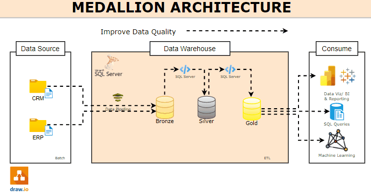
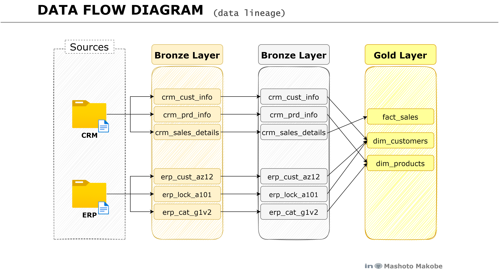
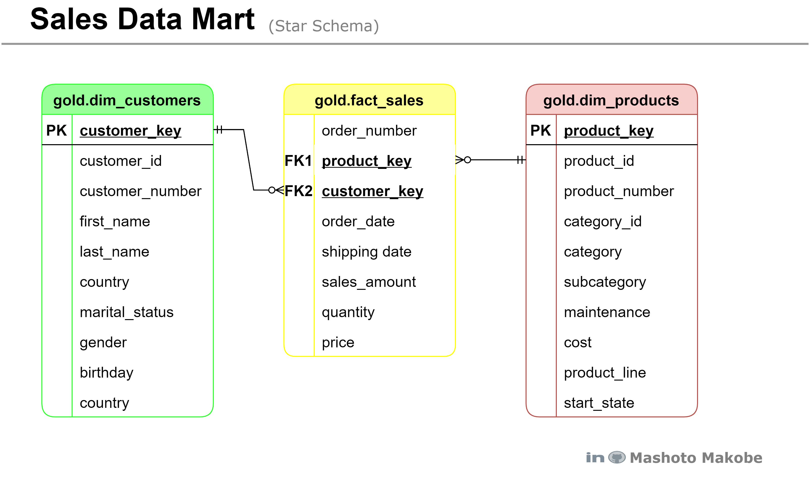
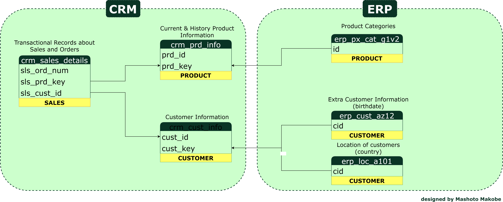

# SQL Data Warehouse Project

Welcome to the **Data Warehouse** repository!
This project demonstrates a comprehensive guide to building and managing a SQL data warehouse covering design principles, data modeling, ETL and best practices.

Object Type: Tables
Load:
Batch Processing
Full Load (Truncate & Insert)
No transformation
Data Model: None ( As-is)

## Data Architecture

The data architecture for this project follows Medallion Architecture **Bronze**, **Silver**, and **Gold** layers:


This link **[here](docs/high_level_architecture.png)** provide a more detailed diagram of the the architecture

1. **Bronze Layer**: Stores raw data as-is from the source systems. Data is ingested from CSV Files into SQL Server Database.
2. **Silver Layer**: This layer includes data cleansing, standardization, and normalization processes to improve the data's quality and usability, and prepares the it for analysis.
3. **Gold Layer**: Data is aggregated, summarized, and modeled into a star schema for analytics and reporting, providing business-ready insights and metrics.

## Data flow Diagram



## Data Model



The data model comprises of a network of interconnected entities that facilitate the management of customer transactions. At its core, the model defines the relations between the customers, orders and products.

* **Customers** initiate the orders, which are uniquely identified.
* **Orders** are comprised of a multiple of order items, each referencing a specific ```product```, and ```quantity```.
* **Products** are categorized into categories and subcategories, enabling hierarchical product classification. They also have distinct attributes such as ```product_id```, ```product_name``` and ```price```.

## Intergration Model




## Repository Structure

```
data-warehouse-project/
│
├── datasets/                           # Raw datasets used for the project (ERP and CRM data)
│
├── docs/                               # Project documentation and architecture details
│   ├── etl.drawio                      # Draw.io file shows all different techniques and methods of ETL
│   ├── data_architecture.drawio        # Draw.io file shows the project's architecture
│   ├── data_catalog.md                 # Catalog of datasets, including field descriptions and metadata
│   ├── data_flow.drawio                # Draw.io file for the data flow diagram
│   ├── data_models.drawio              # Draw.io file for data models (star schema)
│   ├── naming-conventions.md           # Consistent naming guidelines for tables, columns, and files
│
├── scripts/                            # SQL scripts for ETL and transformations
│   ├── bronze/                         # Scripts for extracting and loading raw data
│   ├── silver/                         # Scripts for cleaning and transforming data
│   ├── gold/                           # Scripts for creating analytical models
│
├── tests/                              # Test scripts and quality files
│
├── README.md                           # Project overview and instructions
├── LICENSE                             # License information for the repository
└── gitignore                           # Files and directories to be ignored by Git
```

---

## License

This project is licensed under the [MIT License](LICENSE). You are free to use, modify, and share this project with proper attribution.

## Credits

## About Me

Let's stay in touch! Feel free to connect with me on the following platforms:

Insert all the platform here
