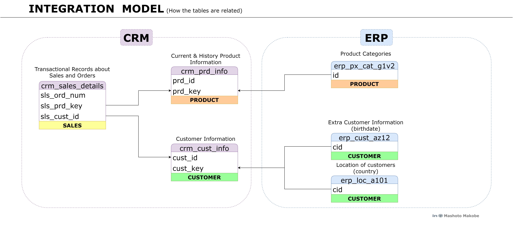

# SQL Data Warehouse Project

Welcome to the **Data Warehouse** repository!

This project delivers a scalable data warehousing solution that integrates data from various sources, empowering data-driven decision-making through a robust data architecture, ETL pipeline, and  data modeling. By leveraging industry best practices and a medallion data architecture (Bronze, Silver, and Gold), this solution ensures data quality, consistency and reliability.

## Project Overview

1. **Data Ingestion**: Collect data from two data systems (ERP and CRM) provided as CSV files.
2. **Data Transformation**: Transform the data into usable format.
3. **Data Quality**: Implement data quality checks to ensure data accuracy and consistency.
4. **Data Storage**: Design a scalable data storage solution.
5. **Data Modeling**: Develop a data model to support BI and reporting.

## Data Architecture

### Medallion Architecture

The data architecture for this project follows Medallion Architecture **Bronze**, **Silver**, and **Gold** layers:


The link **[here](docs/high_level_architecture.png)** provide a more detailed diagram of the data .

1. **Bronze Layer**: Stores raw data as-is from the source systems. Data is ingested from CSV Files into SQL Server Database.
2. **Silver Layer**: This layer includes data cleansing, standardization, and normalization processes to improve the data's quality and usability, and prepares the it for analysis.
3. **Gold Layer**: Data is aggregated, summarized, and modeled into a star schema for analytics and reporting, providing business-ready insights and metrics.


The diagram illustrates the flow of data through the Bronze, Silver and Gold layers, showcasing the movement of data between tables within each layer. It also provides a clear representation of the data architecture and the relationships between the different entities.

## Implementation Details

### ETL  pipeline

|           | Bronze   | Silver   |  Gold    |
|:----------|----------|----------|----------|
|**Object Type**|   Tables     |    Tables    |    None    |
|**Load Method**|    Full Load (*Truncate & Insert*)    |    Full Load (*Truncate & Insert*)     |    None    |
|**Data Transformation**|   None    |    <ul><li>Data **Cleaning**</li><li>Data **Standardization**</li><li>Data **Normalization**</li><li>Data **Enrichment**</li></ul>  |    <ul><li>Data **Integration**</li><li>Data **Aggregation**</li><li>**Business Logic & Rules**</li></ul>  |
|**Data Modeling**|   None      |    None    |    <ul><li>**Star Schema**</li><li>**Aggregated Objects**</li><li>**Flat Tables**</li></ul>   |


### Data Quality Checks

To ensure the integrity and reliability of the dataset, a series of data quality checks for the silver and gold layer were done. The following code illustrates a snippet of thus quality checks from the silver layer.

```sql
-- ------------------------------------CRM Tables--------------------------------
-- ==============================================================================
-- Checking 'silver.crm_cust_info'
-- ==============================================================================
-- Check for NULLS or duplicate keys
-- Expectation : No results 
SELECT 
     cst_id,
     COUNT(*) 
FROM silver.crm_cust_info
GROUP BY cst_id
HAVING COUNT(*) > 1 OR cst_id IS NULL;

-- Checking for unwanted spaces
-- Expectation = No results
SELECT 
     cst_firstname, 
     cst_lastname
FROM silver.crm_cust_info
WHERE 
     (cst_firstname <>  TRIM(cst_firstname)) OR  
     (cst_lastname <> TRIM(cst_lastname));

-- Data standardization and consistency
SELECT DISTINCT cst_gndr
FROM bronze.crm_cust_info

```
For a more comprehensive overview of the data quality checks and results, please refer to the  [data_quality_checks](/tests/)

## Integration



## Data Modeling

The data model is designed to support efficient querying and analysis. It includes:

* **Fact Table** (```gold.fact_orders```): Contains measurable data.
* **Dimension Tables** (```gold.dim_customers``` and ```gold.dim_products```): Provide context for analysis.
* **Data Marts**: Subsets of the data warehouse, focused on the specific business value.


 
### Tools and technology

- **[Datasets](datasets/):** Access to the project dataset (csv files).
- **[SQL Server Express](https://www.microsoft.com/en-us/sql-server/sql-server-downloads):** Lightweight server for hosting your SQL database.
- **[SQL Server Management Studio (SSMS)](https://learn.microsoft.com/en-us/sql/ssms/download-sql-server-management-studio-ssms?view=sql-server-ver16):** GUI for managing and interacting with databases.
- **[Git Repository](https://github.com/):** Set up a GitHub account and repository to manage, version, and collaborate on your code efficiently.
- **[Git](link):** Track and revise changes.
- **[Visual Studio Code](link):** Write, debug and test SQL scripts and analytics code.
- **[DrawIO](https://www.drawio.com/):** Design data architecture, models, flows, and diagrams.
- **[Notion](https://www.notion.com/):** All-in-one tool for project management and organization.

## Repository Structure

```
data-warehouse-project/
│
├── datasets/                           # Raw datasets used for the project (ERP and CRM data)
│
├── docs/                               # Project documentation and architecture details
│   ├── etl.drawio                      # Draw.io file shows all different techniques and methods of ETL
│   ├── data_architecture.drawio        # Draw.io file shows the project's architecture
│   ├── data_catalog.md                 # Catalog of datasets, including field descriptions and metadata
│   ├── data_flow.drawio                # Draw.io file for the data flow diagram
│   ├── data_models.drawio              # Draw.io file for data models (star schema)
│   ├── naming-conventions.md           # Consistent naming guidelines for tables, columns, and files
│
├── scripts/                            # SQL scripts for ETL and transformations
│   ├── bronze/                         # Scripts for extracting and loading raw data
│   ├── silver/                         # Scripts for cleaning and transforming data
│   ├── gold/                           # Scripts for creating analytical models
│
├── tests/                              # Test scripts and quality files
│
├── README.md                           # Project overview and instructions
├── LICENSE                             # License information for the repository
└── gitignore                           # Files and directories to be ignored by Git
```
---

## License

This project is licensed under the [MIT License](LICENSE). You are free to use, modify, and share this project with proper attribution.

## Author - [Mashoto Makobe](https://github.com/mmashoto)

This project is a part of my portfolio, showcasing the SQL skills essential for data analyst roles. If you have any questions, feedback or would like to colloborate, feel free to get in touch.

Insert all the platform here

## Credits